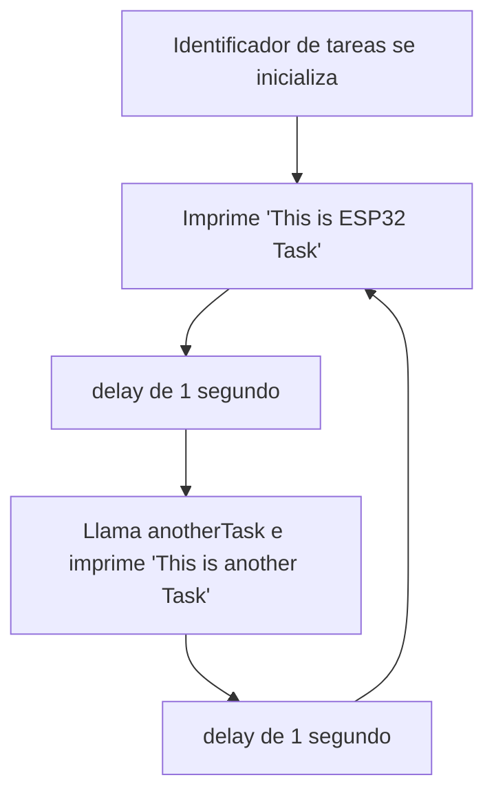
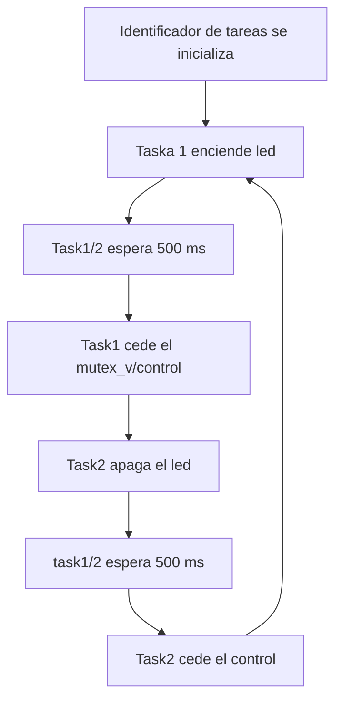

# Procesadores digitales - Práctica 3

## Objetivo
<div align="justify">

El objetivo de esta prática consiste en comprender el funiconamiento de un sistema operativo en tiempo real. Lo haremos generando tareas, sincronizándolas y dando prioridad a unas o a otras.

## Multitarea

Lo primero que tenemos que saber es que para crear una tarea debemos seguir dos pasos: primero crear una función que contenga el código que más adelante querremos ejecutar y a continuación, crear una tarea que la llame. En nuestro caso, llamamos a la función `anotherTask`. Esta tendrá un bucle infinito con `for(;;)` que le hará imprimir por pantalla `this is another task` cada 1 segundo de reloj. Obtenemos este resultado con `delay(1000)`. Es una tarea que no se detiene a menos que lo paremos manualmente ya que con `vTaskDelete(NULL)` conseguimos que nunca llegue al final. Como no asignamos ningún período en el cual no deba ejecutarse el programa, simplemente este continúa ejecutándose. 

```cpp
void anotherTask(void * parameter){
for(;;){
    Serial.println("this is another Task");
    delay(1000);
    }
vTaskDelete(NULL);
}
```

Seguidamente, avisamos al planificador que deberá realizar la tarea. Para hacerlo, llamamos `xTaskCreate()`, una función de FreeRTOS que permite poner a la cola la tarea deseada después de las diferentes tareas que ya están preparadas para llevarse a cabo. Dentro de esta, llamamos a nuestra función `anotherTask()` creada anteriormente, le ponemos un nombre para facilitar el trabajo, le asignamos el tamaño de la pila de tareas especificado como el número de variables que puede contener la pila; no debe cofundirse con el número de bytes, en este caso tenemos una medida de pila de `10000`; además, para ejecutar la tarea no necesitamos pasarle ningun parámetro por lo que ponemos a `NULL` su valor, igual que en el último campo, que también lo establecemos en `NULL` al ser opcional, ya que no creamos un identificador a la tarea creada fuera de la función `xTaskCreate()`. El `1` entre esos dos campos que declaramos nulos, se refiere a la prioridad que le damos a la tarea. En el caso que nos ocupa, no tiene un gran valor ya que tan solo ejecutamos una sola tarea pero se tiene que tener en cuenta que no siempre, en realidad en la mayoría de los casos, tendremos más de una tarea a ejecutar y el planificador necesitará saber en qué orden deberá realizar cada una de ellas. Curiosamente, la prioridad que le damos va a ser mayor como más grande sea el número, es decir, una prioridad de 2 está por encima que una de 1. El código a implementar es el siguiente, dentro del `setup()`:

```cpp
void setup(){
xTaskCreate(
    anotherTask,
    "another Task",
    10000, 
    NULL, 
    1, 
    NULL);
}
```
Finalmente, en el `loop()` tan solo imprimos por pantalla `this is ESP32 Task` y lo hacemos con un retraso de `delay(1000)`, es decir, lo sacamos por pantalla cada segundo. Juntando todo lo explicado, nos queda un código resultante como el siguiente:

```cpp
#include <Arduino.h>

void anotherTask(void * parameter);

void setup(){
Serial.begin(112500);
xTaskCreate(
    anotherTask, 
    "another Task",
    10000, 
    NULL,
    1, 
    NULL); 
}

void loop(){
    Serial.println("this is ESP32 Task");
    delay(1000);
}

void anotherTask( void * parameter ){
for(;;){
    Serial.println("this is another Task");
    delay(1000);
    }

vTaskDelete( NULL );
}
```

Con un resultado que va alternando ambos mensajes ya que se ejecuta el bucle, la tarea y vuelve a empezar de nuevo, dado que programamos un bucle infinito.

```cpp
this is ESP32 Task
this is another Task
this is ESP32 Task
this is another Task
this is ESP32 Task
...
```

### Diagrama de flujo



## Semáforo Mutex

Esta segunda parte consiste en realizar un programa que utilice dos tareas: una que enciende un led y otra que lo apaga. Dichas tareas deben estar sincronizadas.

Primero de todo, como en cualquier programa hay que declarar las diferentes variables. En este caso se declaran dos tareas: `Task1`, `Task2` y un identificador de tareas ``mutex_v``.
```cpp
SemaphoreHandle_t mutex_v; 

void Task1(void *pvParameters);
void Task2(void *pvParameters);
```

A continuación nos encontramos con el `setup()`, en el cual:

* Se declara el pin en el que se pondrá nuestro Led, en nuestro caso el 17.

* Se comprueba si se ha creado bien nuestro identificador de tareas, para ello 
utilizamos `xSemaphoreCreateMutex()`. En caso de fallida, se devolverá por pantalla `Mutex can not be created`. 
```cpp
    mutex_v = xSemaphoreCreateMutex(); 
    if (mutex_v == NULL) { 
        Serial.println("Mutex can not be created"); 
    }
```

Por último se ponen en funcionamiento las dos tareas en paralelo, `Task1` y `Task2`:

```cpp
    xTaskCreate(Task1, "Task1", 1000, NULL, 1, NULL); 
    xTaskCreate(Task2, "Task2", 1000, NULL, 1, NULL); 
```

``Task1``: 
Esta tasca tiene un funcionamiento muy simple, su único propósito consiste en encender el led y ceder el control. Entre cada instruccion, espera ``500 ms``.

```cpp
void Task1(void *pvParameters) { 
    while(1) { 
        xSemaphoreTake(mutex_v, portMAX_DELAY); 
        Serial.println("Hi from Task1"); 
        digitalWrite(17,HIGH);
        
        vTaskDelay(pdMS_TO_TICKS(500)); 
        xSemaphoreGive(mutex_v); 
        vTaskDelay(pdMS_TO_TICKS(500)); 
    } 
} 
```

``Task2``:
La ``Task2`` tiene una estructura de funcionamiento muy parecida a la primera, pero en vez de encender el led, se dedica a apagarlo. 

```cpp
void Task2(void *pvParameters) { 
    while(1) { 
        xSemaphoreTake(mutex_v, portMAX_DELAY); 
        Serial.println("Hi from Task2"); 
        digitalWrite(17,LOW);

        vTaskDelay(pdMS_TO_TICKS(500)); 
        xSemaphoreGive(mutex_v); 
        vTaskDelay(pdMS_TO_TICKS(500)); 
    } 
} 

void loop() { }
```

### Diagrama de flujo


